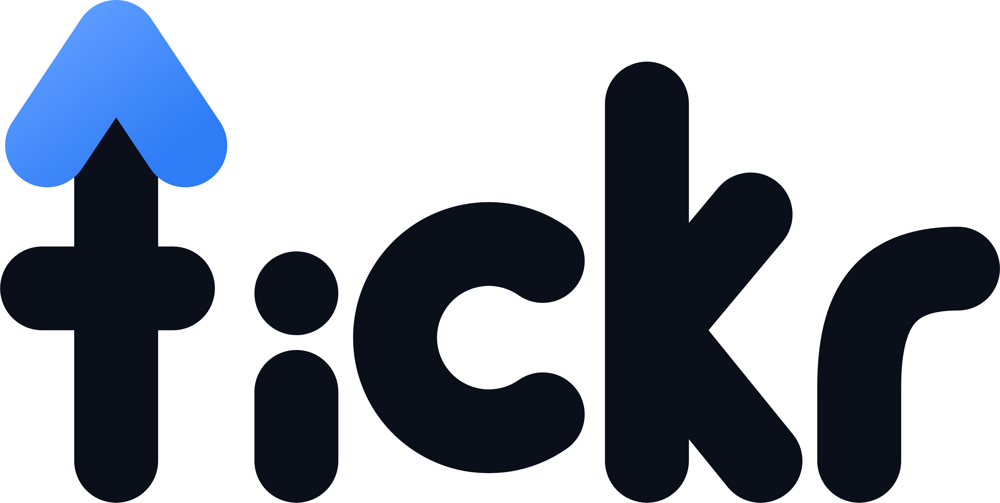
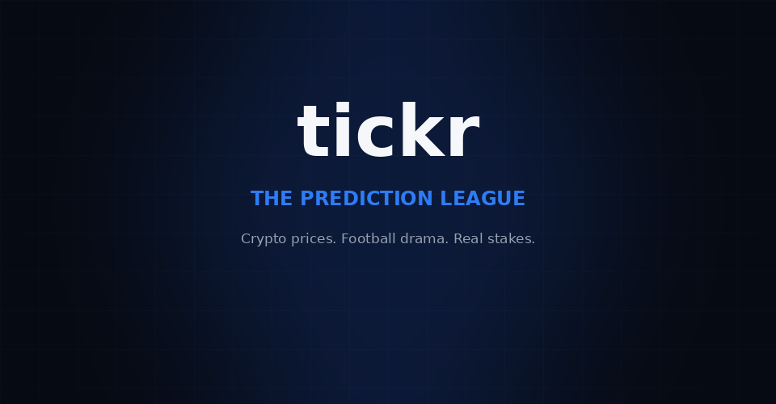
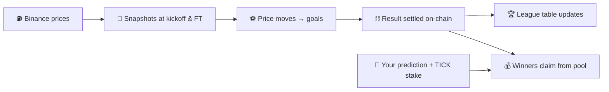
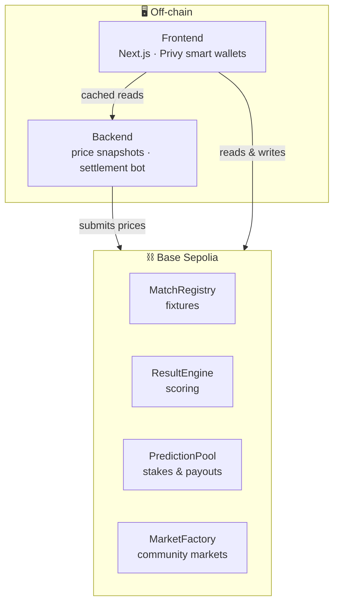

<div align="center">

<picture>
  <source media="(prefers-color-scheme: dark)" srcset="packages/frontend/public/tickr-logo/v2-rising-t/png/tickr-word-light.png" />
  
</picture>

### Crypto has a league table now.

**TICKR is a decentralized prediction market built like a football season.**
Coins are the teams. Price moves are the goals. You call the result, stake TICK, and chase the table.

[](https://tickr-rouge.vercel.app)
[](https://sepolia.basescan.org)
[](https://tickr-rouge.vercel.app)



[🎮 Open the app](https://tickr-rouge.vercel.app) · [📖 How to play](https://tickr-rouge.vercel.app/how-to-play) · [🧠 How it works](https://tickr-rouge.vercel.app/about) · [🗺 Roadmap](https://tickr-rouge.vercel.app/roadmap)

</div>

---

## ⚡ The 10-second version

1. **20 cryptocurrencies** play a full football-style season — 380 fixtures, league table, the works.
2. Each **fixture is a match**: the two coins' price performance over the match window becomes the **scoreline** — every 0.5% of price move scores a goal.
3. You **predict Home / Draw / Away**, stake **TICK**, and winners split the pool. Results settle **on-chain**, verifiable by anyone.

No casino vibes. No isolated yes/no questions. A season you can belong to.

## 🆚 Why TICKR, not Polymarket?

| | TICKR | Typical prediction markets |
|---|---|---|
| **Format** | Season-long league: fixtures, table, rivalries | Disconnected one-off questions |
| **What's being predicted** | Relative crypto performance, turned into scores | Anything, no shared narrative |
| **Social layer** | Profiles, pick records, predictor leaderboards | Mostly anonymous betting |
| **Market creation** | Permissionless — 5 templates, anyone can list | Curated / gated |
| **Settlement** | Deterministic scoring rules, recomputable from on-chain events | Often subjective resolution |
| **Onboarding** | Email login, smart wallet, gasless txs | Wallet + gas required |

## 🎮 How a match works



1. **Two coins face off.** Every fixture has a scheduled kickoff and a fixed match window.
2. **Price moves become goals.** Each coin's % price change over the window is converted to goals (0.5% = 1 goal), with a no-negative rule so scorelines always read like football.
3. **You call it.** Stake TICK on Home, Draw, or Away in the fixture's pool — odds move live with the stakes.
4. **It settles on-chain.** The ResultEngine records the score; winners claim their share of the pool minus a small treasury fee.
5. **The table moves.** 3 points for a win, 1 for a draw — just like football.

Full scoring math, worked examples, and the audit guide live on the [About page](https://tickr-rouge.vercel.app/about).

## 🏟 Markets beyond fixtures

Anyone can create a prediction market from five on-chain templates:

- 🏆 **Season champion** — who lifts the trophy
- 📈 **Top gainer** — biggest % move in a matchday
- ⚔️ **Head-to-head** — coin A vs coin B, who gains more
- 🎯 **Price target** — does a coin finish above/below a price
- 📏 **Fixture spread** — win by / avoid losing by a goal margin

Market creators earn a **revenue share** of their markets' fees.

## 🔴 Live right now — Season 2

**CTF Season 1** · 380 fixtures · Base Sepolia · all pools seeded

| Contract | Address |
|---|---|
| MatchRegistry | [`0xd5b0d27bb9c523ed777f355191a9dd2dcbee0c62`](https://sepolia.basescan.org/address/0xd5b0d27bb9c523ed777f355191a9dd2dcbee0c62) |
| TeamRegistry | [`0x352e6fce9c07de4bf3e187ce93a0120db05d2ea8`](https://sepolia.basescan.org/address/0x352e6fce9c07de4bf3e187ce93a0120db05d2ea8) |
| MarketFactory | [`0x915c36ffb6fe3cd65780fcafa2b489ce6eafdca1`](https://sepolia.basescan.org/address/0x915c36ffb6fe3cd65780fcafa2b489ce6eafdca1) |
| ResultEngine | [`0x82e00f543ddf320eec4447fd16810852bda4ec12`](https://sepolia.basescan.org/address/0x82e00f543ddf320eec4447fd16810852bda4ec12) |
| PredictionPool | [`0xc47358e69d145f94728796a337ec14401641700f`](https://sepolia.basescan.org/address/0xc47358e69d145f94728796a337ec14401641700f) |
| PriceOracle | [`0x2814bd64f7774eccd5dc11a792f15fecdfebdf90`](https://sepolia.basescan.org/address/0x2814bd64f7774eccd5dc11a792f15fecdfebdf90) |
| TickToken (TICK) | [`0xD7DAd21d5e61f398c88dA6d15b5CD03f6bBc499b`](https://sepolia.basescan.org/address/0xD7DAd21d5e61f398c88dA6d15b5CD03f6bBc499b) |
| SeasonRegistry | [`0xe6f2c8a55a3f4f34a7abd833afece63d9789c260`](https://sepolia.basescan.org/address/0xe6f2c8a55a3f4f34a7abd833afece63d9789c260) |

Every settlement emits on-chain events — anyone can recompute any scoreline independently. That's the point.

## 🏗 The stack



| Package | What it is |
|---|---|
| [`packages/frontend`](packages/frontend) | Next.js app — fixtures, staking, markets, profiles, leaderboards. Privy embedded wallets, gasless transactions. |
| [`packages/backend`](packages/backend) | Price engine + settlement bot. Binance WS primary, CoinGecko fallback. Submits kickoff/FT snapshots, settles fixtures. |
| [`packages/contracts`](packages/contracts) | Solidity — registries, scoring engine, pools, market factory. Hardhat + Ignition. |
| [`packages/shared`](packages/shared) | Team lists, chain config, constants shared across the monorepo. |

## 🚀 Run it locally

Requirements: Node.js `22.10+` (below `25`), `pnpm` `10`.

```bash
pnpm install
pnpm dev
```

Copy the env templates first — never commit secrets:

```bash
cp packages/frontend/.env.example packages/frontend/.env
cp packages/backend/.env.example packages/backend/.env
```

| Command | Does what |
|---|---|
| `pnpm dev` | All packages in dev mode |
| `pnpm build` | Production build |
| `pnpm lint` | Lint everything |
| `pnpm test` | Contract + unit tests |

## 🗺 Roadmap

| Phase | Status | What's in it |
|---|---|---|
| **1 · Beta launch** | ✅ Live | Testnet season, 380 fixtures, 5 market templates, social layer |
| **2 · Testnet hardening** | 🔄 Now | Settlement verification, full auditability, load hardening |
| **3 · Mainnet Alpha** | 📅 H1 2027 | Base mainnet + real TICK token launch, creator revenue share, flexible staking (TICK + Base-native + wrapped coins) |
| **4 · Stable mainnet** | 🔭 Next | More leagues, sponsored league campaigns, mobile app, governance |

Full whitepaper version: [tickr-rouge.vercel.app/roadmap](https://tickr-rouge.vercel.app/roadmap)

## 📚 Docs

- [How to play](https://tickr-rouge.vercel.app/how-to-play) — the player's guide
- [About TICKR](https://tickr-rouge.vercel.app/about) — scoring math, leaderboards, audits, decentralization
- [Build spec](tickr-build-spec%20(1).md) — the original v0.1 spec
- [Social setup](SOCIAL_SETUP.md) — social layer integration notes

<details>
<summary><strong>⚠️ Disclaimers</strong></summary>

<br />

TICKR is software for making predictions — not financial advice, not a promise of returns. Crypto prices move sharply, stakes can be lost, and blockchain transactions may be irreversible. Understand the market rules, the token, the network, and the contracts before participating.

**Decentralization, honestly:** fixtures, scoring, pools, and payouts live in smart contracts, and every settlement is recomputable from public on-chain events. The price-feed service that submits observations, plus the website and its hosting, are operated by the team — those parts are centralized. No fake decentralization claims here.

</details>

<details>
<summary><strong>© Rights</strong></summary>

<br />

**All rights reserved.** No license is granted to use, copy, modify, distribute, sublicense, or create derivative works from this repository or its contents without prior written permission from the rights holder. The absence of a license file does not grant permission.

</details>
