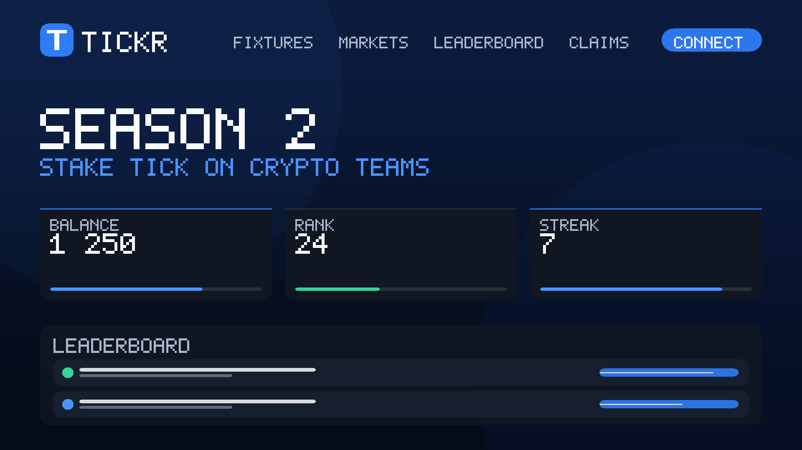
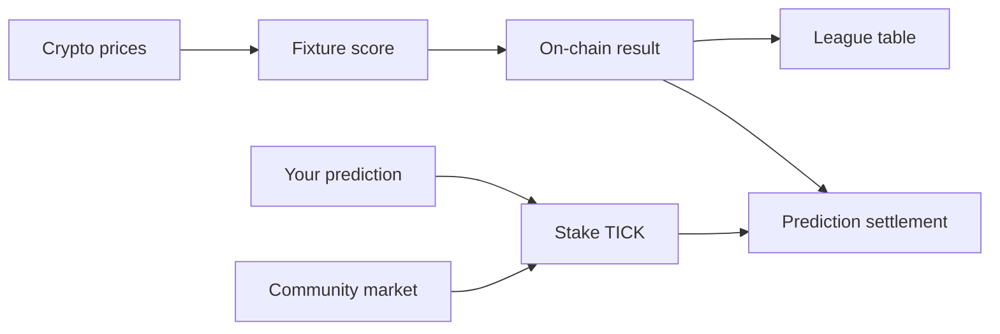

<div align="center">


### Crypto has a league table now.

**TICKR is a decentralized crypto price prediction market built like a football season.**  
Coins are the teams. Price moves are the goals. You pick the result, stake TICK, and follow the table.

[Open TICKR](https://tickr-rouge.vercel.app) · [How to play](https://tickr-rouge.vercel.app/how-to-play) · [About TICKR](https://tickr-rouge.vercel.app/about)

<br />



</div>

## The idea

Most prediction markets are a list of separate questions. TICKR turns crypto price predictions into a season-long competition.

Each fixture matches two cryptocurrencies over a set time window. Their price performance determines the score. Predict a home win, draw, or away win, then stake TICK on your call. Results feed a league table, while permissionless markets let the community ask new questions about matchdays, teams, and prices.



## How a match works

1. **Two coins face off.** A fixture has a scheduled kickoff and a defined match window.
2. **Price movement becomes goals.** The score is calculated from each coin’s price change during the fixture.
3. **Pick the outcome.** Stake TICK on a home win, draw, or away win in the fixture’s prediction pool.
4. **The result settles on-chain.** The contract records the result; eligible winners can claim their share of the pool under the market’s rules.
5. **The season table updates.** Teams earn 3 points for a win, 1 for a draw, and 0 for a loss.

The score is not a claim that a coin literally scored a goal: it is a familiar way to follow relative crypto performance. Full scoring rules and examples are on the [About page](https://tickr-rouge.vercel.app/about).

## Markets beyond fixtures

TICKR also supports community-created, on-chain prediction markets. The app includes templates for:

- **Top gainer:** which coin gains the most in a matchday.
- **Season champion:** which team finishes first.
- **Head-to-head:** whether one coin outperforms another.
- **Price target:** whether a coin finishes above or below a set price.
- **Fixture spread:** whether a team wins by, or avoids losing by, a defined goal margin.

Anyone can create a market using an available template. Each market states its outcomes and resolution terms so participants know what they are predicting.

## What makes it decentralized

TICKR is designed so that core outcomes and funds live in smart contracts rather than in a company account. The contracts handle fixtures, scoring, prediction pools, market outcomes, and claims. Contract events make the inputs and settlements publicly inspectable, and the published scoring rules let anyone recompute a result.

The website is an interface to those contracts; it is not the only way to read or interact with them. TICKR still relies on an operated price-feed service to submit price observations, and the website and its hosting are operated by the team. Those parts are not decentralized. Submitted observations and settlement events are on-chain so users can audit the results.

The project is configured for Base networks, with Base Sepolia as the repository’s default development environment. Always check the selected network and contract addresses in the app before interacting.

## At a glance

| | |
| --- | --- |
| **Category** | Decentralized crypto price prediction market |
| **Format** | Season-based league, fixtures, live scores, and community markets |
| **Prediction token** | TICK |
| **Settlement** | Smart contracts on Base |
| **Verification** | Public contract events and reproducible scoring rules |
| **People layer** | Profiles, pick records, and predictor leaderboards |

## Explore the project

- [Play guide](https://tickr-rouge.vercel.app/how-to-play) — the participant’s guide to fixtures, stakes, and markets.
- [About and scoring](https://tickr-rouge.vercel.app/about) — match math, leaderboards, audits, and decentralization details.
- [Roadmap](https://tickr-rouge.vercel.app/roadmap) — planned product direction.
- [Smart contracts](packages/contracts/contracts) — the on-chain rules and market components.
- [Frontend](packages/frontend) · [Backend](packages/backend) · [Shared project data](packages/shared).

## For contributors

The repository contains the TICKR website, a backend service for price and chain data, smart contracts, and shared project data. The interface is intended to be useful to players first; the source is here for people who want to inspect, build, or contribute to the product.

Requirements: Node.js `22.10` or newer (below `25`) and pnpm `10`.

```bash
pnpm install
pnpm dev
```

The monorepo scripts are `pnpm dev`, `pnpm build`, `pnpm lint`, and `pnpm test`. Local development may require environment values for the selected chain, wallet sign-in, and optional backend or social services. See [`packages/frontend/.env.example`](packages/frontend/.env.example) and [`packages/backend/.env.example`](packages/backend/.env.example); keep secrets in local environment files and never commit them.

## Important

TICKR is software for making predictions, not financial advice or a promise of returns. Crypto prices can move sharply, prediction stakes can be lost, and blockchain transactions may be irreversible. Understand the market rules, token, selected network, and contract before you participate.

## Rights

**All rights reserved.** No license is granted to use, copy, modify, distribute, sublicense, or create derivative works from this repository or its contents without prior written permission from the rights holder. The absence of a license file does not grant permission.
